# 一、下载OmniNex

GitHub地址：https://github.com/VirgoLee/OmniNex

夸克网盘：https://pan.quark.cn/s/63ac466ec44a 提取码：d4d2

下载之后解压，我这里解压在E盘中：

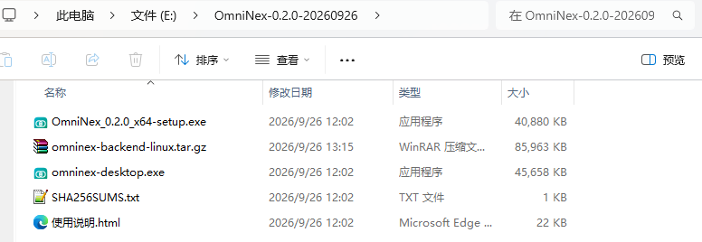

-   OmniNex_0.2.0_x64-setup.exe：安装版桌面客户端（运行在Windows上）
-   omninex-backend-linux.tar.gz：后端（运行在Linux上）
-   omninex-desktop.exe：免安装版桌面客户端（运行在Windows上）

# 二、选择OmniNex运行模式，并部署

OmniNex运行分为两种模式：`Windows+WSL模式`和`Windows+远程Ubuntu模式`

|            | ***Windows + WSL 模式（主）** | ***Windows + 远程 Ubuntu 模式（辅）** |
| ---------- | ----------------------------------------- | ------------------------------------------------- |
| 后端在哪   | ***本机 WSL2** 的 Ubuntu 里   | ***另一台独立 Ubuntu 主机**上         |
| 桌面客户端 | Windows exe                               | 相同（同一个 Windows exe）                        |
| 两者连接   | 本机内部通信（互操作）                    | 通过网络连到远端                                  |

两种模式的**桌面端完全一样**，真正的区别只在后端跑在哪。

## 2.1 Windows+WSL模式（主，默认方案）

**架构**：桌面 exe 装在你 Windows 上；后端跑在**同一台机器的 WSL2 Ubuntu** 里。桌面壳通过 localhost 访问本机后端。

### 第1步：安装 WSL+Ubuntu

**全新 Windows 机器上先备好 WSL2 + Ubuntu**

**① 开 CPU 虚拟化**：进 BIOS/UEFI 开启 **Intel VT-x** 或 **AMD-V / SVM**（WSL2 与 KVM 前提，不开则虚拟机退化为软件模拟）。

**② 装 WSL + Ubuntu**（管理员 PowerShell，Win10 2004+ / Win11）：

```
wsl --install -d Ubuntu
```

上述命令速度较慢，所以可以使用如下离线方式：

-   WSL下载：https://github.com/microsoft/WSL/releases（下载之后双击安装即可）
-   WSL Ubuntu下载：https://mirrors.aliyun.com/ubuntu-cdimage/ubuntu-wsl/resolute/daily-live/20260925/resolute-wsl-amd64.wsl（使用下述命令在管理员 PowerShell中运行，其中--from-file来指定resolute-wsl-amd64.wsl文件位置）

```
wsl --install --name Ubuntu --from-file "E:\Users\leyilea\Downloads\resolute-wsl-amd64.wsl"
```

安装好之后，会提示创建账号和密码，我这里使用的是 leyilea/leyilea

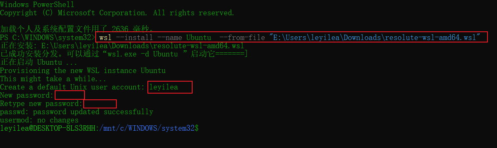

查看当前Windows中的Linux子系统：

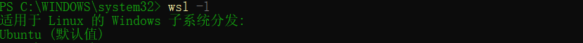

### 第2步：Docker环境+启动后端

使用 `wsl -d Ubuntu`在PowerShell中进入WSL Ubuntu

```
PS C:\WINDOWS\system32> wsl -d Ubuntu
leyilea@DESKTOP-8LS3RHH:/mnt/c/WINDOWS/system32$ 
```

进入到 下载的OmniNex程序目录内，注意WSL的/mnt/e/对应物理机的E盘，具体位置按自己的目录决定

```
leyilea@DESKTOP-8LS3RHH:/mnt/c/WINDOWS/system32$ cd /mnt/e/OmniNex-0.2.0-20260926/   # 进入到下载的OmniNex程序目录
```

解压omninex-backend-linux.tar.gz后端压缩包

```
leyilea@DESKTOP-8LS3RHH:/mnt/e/OmniNex-0.2.0-20260926$ tar -xvf omninex-backend-linux.tar.gz  # 解压
```

进入解压目录并运行start-omninex.sh，会自动安装Docker、KVM、拉取基础镜像等【并启动后端】

```
leyilea@DESKTOP-8LS3RHH:/mnt/e/OmniNex-0.2.0-20260926$ cd /mnt/e/OmniNex-0.2.0-20260926/omninex-backend-1804/
leyilea@DESKTOP-8LS3RHH:/mnt/e/OmniNex-0.2.0-20260926/omninex-backend-1804$ ./start-omninex.sh  # 前台起，监听 0.0.0.0:7150（关终端即停）
```

或注册 systemd 开机自启（推荐）：

-   后续使用systemctl管理即可（服务名omninex-backend）

```
sudo cp omninex-backend.service /etc/systemd/system/
sudo sed -i "s|^User=.*|User=$(whoami)|" /etc/systemd/system/omninex-backend.service
sudo systemctl daemon-reload && sudo systemctl enable --now omninex-backend
```

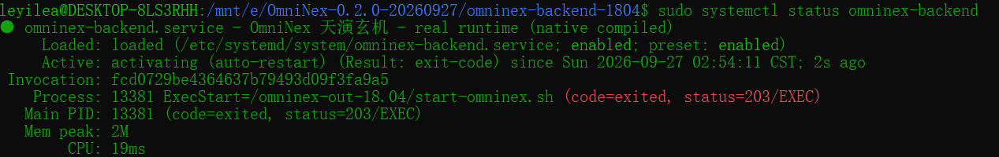

### 第3步：启动前端

双击omninex-desktop.exe（或双击OmniNex_0.2.0_x64-setup.exe安装）

-   如下述过程的“下一步”无法点击，请关闭程序重启

1.  **欢迎页**

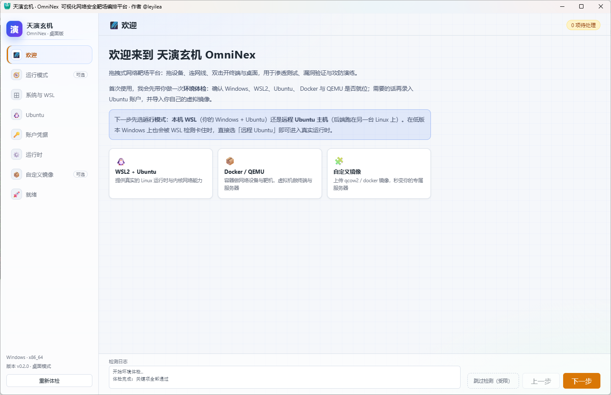

1.  **选择运行模式，推荐“本机WSL”，即**`**Windows+WSL模式**`

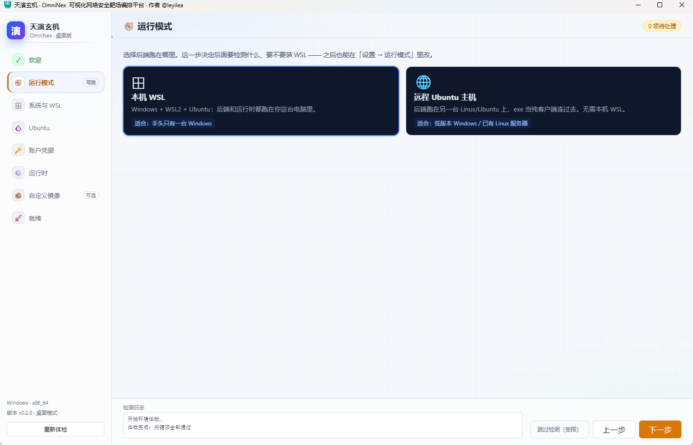

1.  **检查WSL安装情况**

-   Windows版本需要再Windows10 2004版本以上，即支持WSL
-   CPU虚拟化需开启（不会自行网上查询）

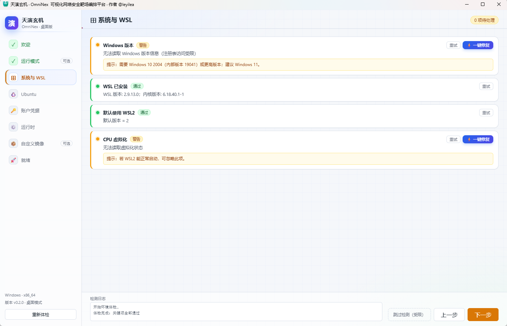

1.  **检查是否安装WSL Ubuntu**

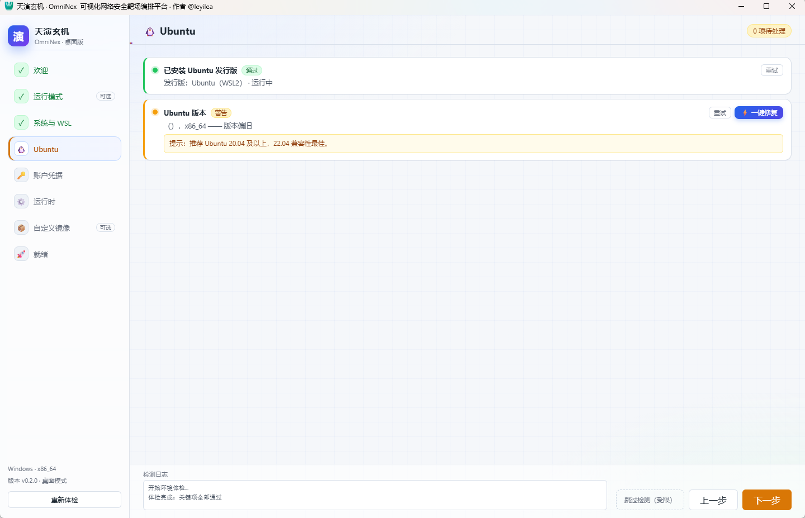

1.  **输入WSL Ubuntu的用户密码**

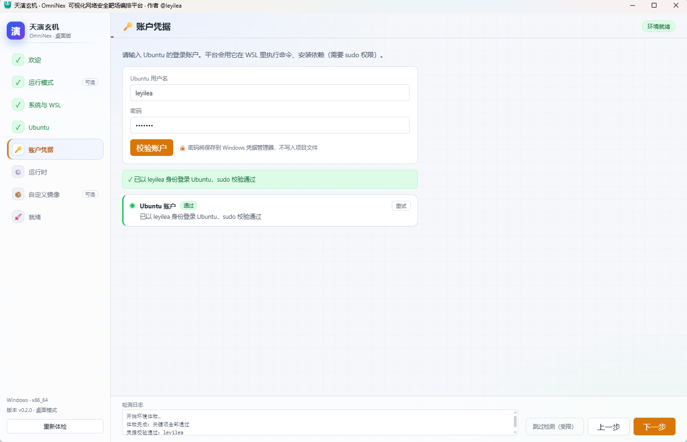

1.  **检查WSL Ubuntu中的Docker和QEMU/KVM虚拟机环境**

-   如果未通过，则第1-2步未完成

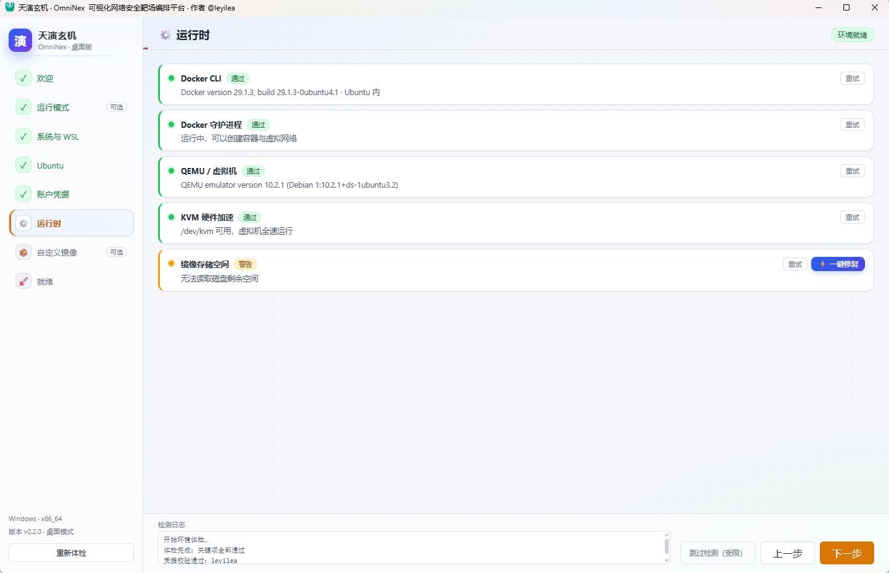

1.  **自定义镜像（直接跳过即可）**

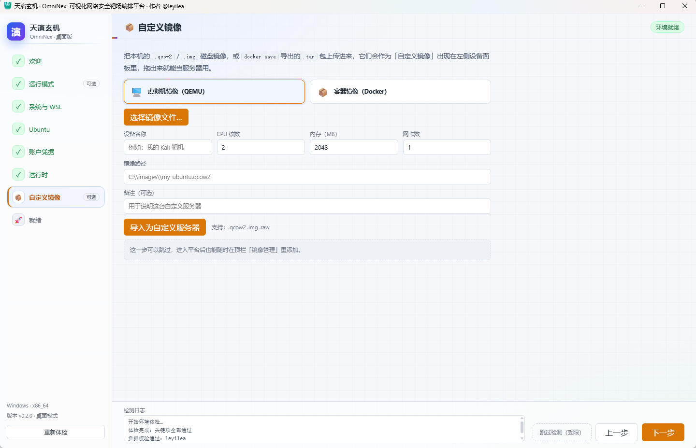

1.  **就绪，启动引擎并进入平台**

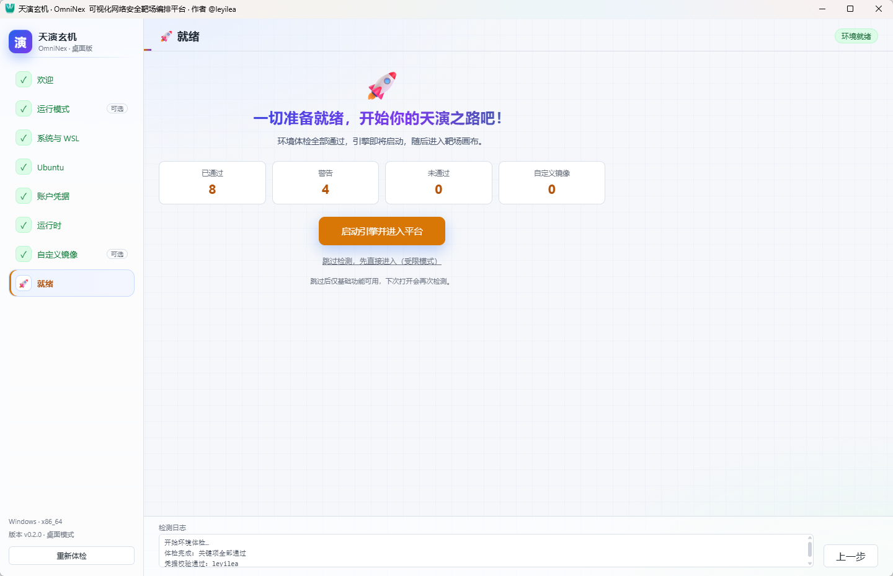

1.  **设置-授权中激活使用**

-   将指纹信息发送给作者@leyilea，之后获得一个授权票据，进行授权使用

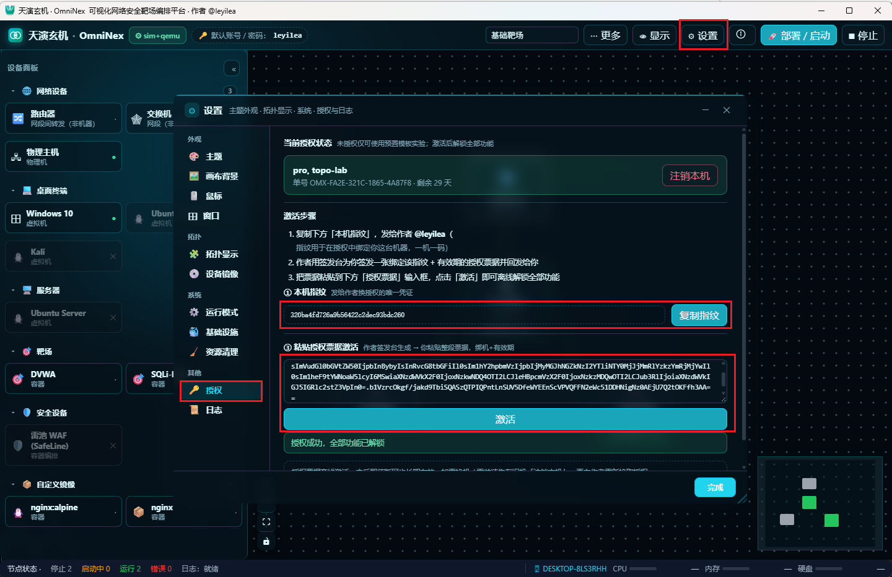

## 2.2 Windows+远程Ubuntu模式（辅，备用方案）

**架构**：桌面 exe 在 Windows；后端跑在**一台独立 Ubuntu 主机**（比如机房/另一台服务器）上。桌面壳通过网络连到那台主机的后端。

### 第1步：Docker环境+启动后端

直接在远端的Ubuntu或者其他Linux中运行。

1.  **将omninex-backend-linux.tar.gz传输到远端Ubuntu中，并解压**

```
tar -xvf omninex-backend-linux.tar.gz  # 解压
```

1.  **进入解压目录并运行start-omninex.sh，会自动安装Docker、KVM、拉取基础镜像等【并启动后端】**

```
cd /omninex-backend-1804/
./start-omninex.sh  # 前台起，监听 0.0.0.0:7150（关终端即停）
```

1.  **或注册 systemd 开机自启（推荐）：**

-   后续使用systemctl管理即可（服务名omninex-backend）

```
sudo cp omninex-backend.service /etc/systemd/system/
sudo sed -i "s|^User=.*|User=$(whoami)|" /etc/systemd/system/omninex-backend.service
sudo systemctl daemon-reload && sudo systemctl enable --now omninex-backend
```

### 第2步：启动前端

双击omninex-desktop.exe（或双击OmniNex_0.2.0_x64-setup.exe安装）

-   如下述过程的“下一步”无法点击，请关闭程序重启

1.  **欢迎页**


1.  **选择运行模式，**`**Windows+远程Ubuntu模式**`

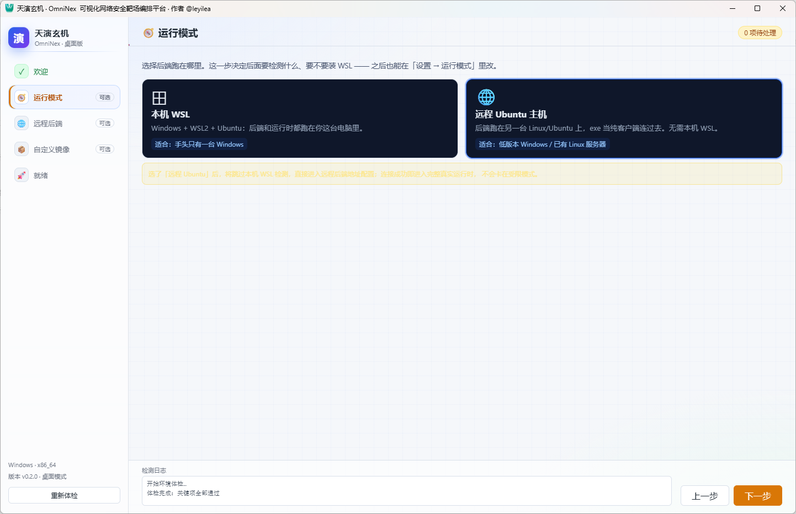

1.  **连接远程后端，注意端口为固定7150**

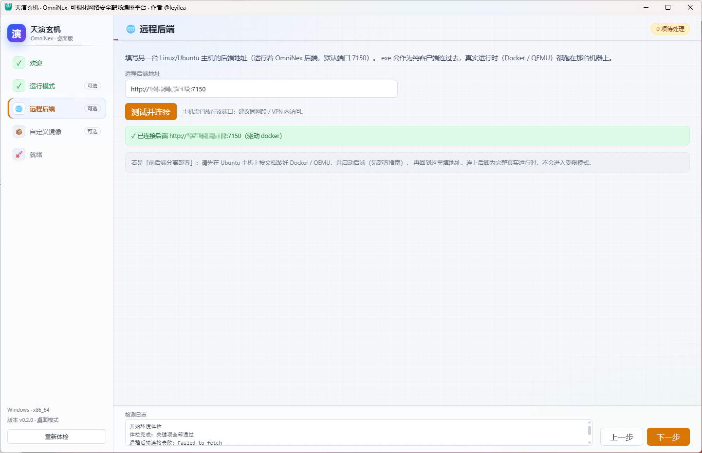

1.  **自定义镜像（直接跳过即可）**

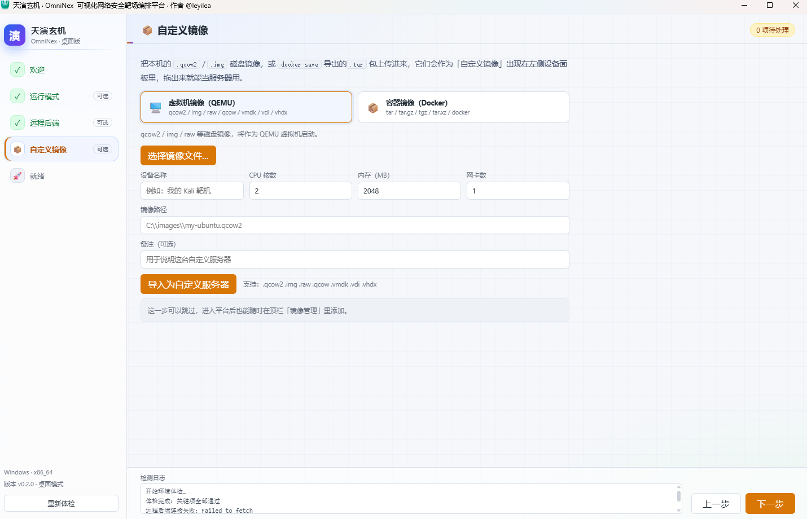

1.  **就绪，启动引擎并进入平台**

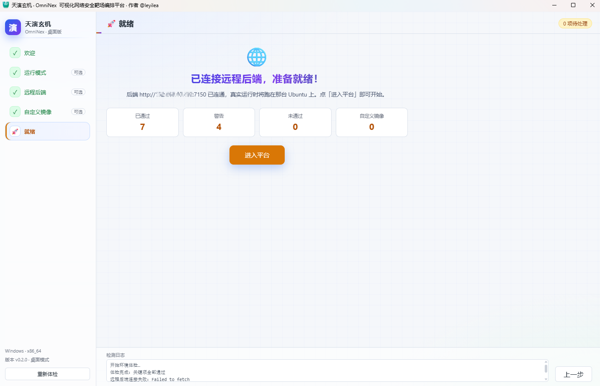

1.  **设置-授权中激活使用**

-   将指纹信息发送给作者@leyilea，之后获得一个授权票据，进行授权使用


# 三、下载并准备镜像

## 3.1 准备基础镜像

在基础镜像中选择`构建网络设备镜像`、`构建连线工具镜像`、`DHCP镜像`，之后点击“拉取所选”，这是构建基础能力的镜像，务必拉取。其他靶场镜像，需要再拉取~

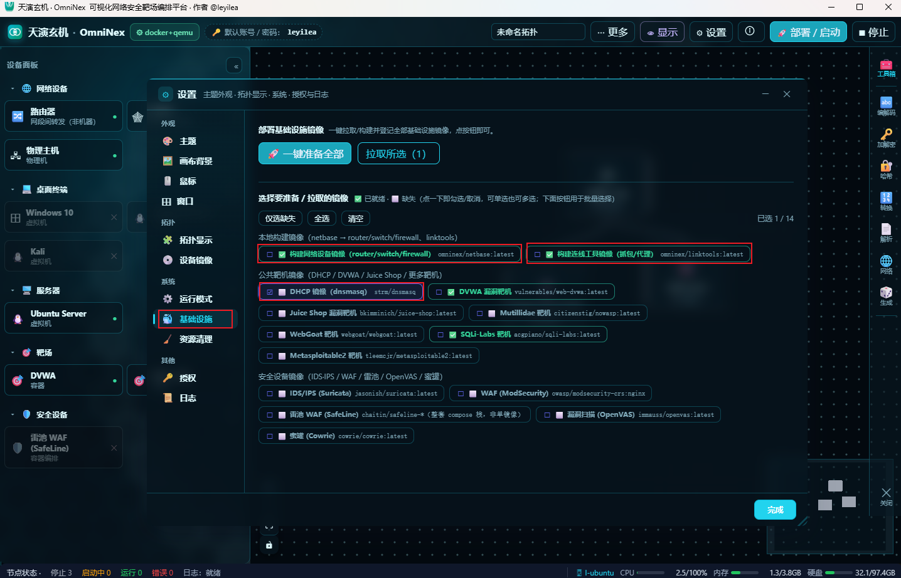

## 3.2 准备设备镜像

### 第1步：下载

1.  **在“设备镜像”-“镜像仓库”中下载需要的镜像（虚拟机）**

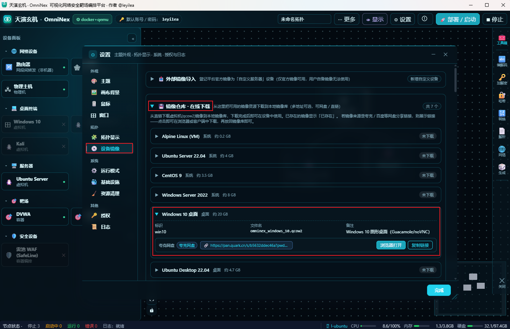


### **第2步：将镜像放入特定目录**

-   `Windows+WSL模式 `可放在Windows系统中/亦可放在WSL Ubuntu中
-   `Windows+远程Ubuntu模式` 需放在远程Ubuntu中

以下载的omninex_ubuntu-server_18.04.6.qcow2为例：

#### Windows+WSL模式

1.  **将镜像放入了**`**E:\OmniNex-0.2.0-20260927\omninex-backend-1804\data\images**` （这个位置可以是Winodws中的任意位置）

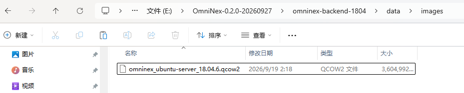

1.  **则对应WSL Ubuntu中的路径为**`**/mnt/e/OmniNex-0.2.0-20260927/omninex-backend-1804/data/images**`（如果是别的位置，在WSL Ubuntu中找到对应路径即可）

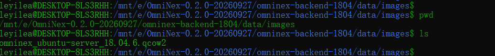

1.  **在OmniNex平台中设置对应路径**

2.  -   镜像标识的版本号修改为下载的qcow2对应版本号，这里是`18.04.6`，则镜像标识改成`omninex/ubuntu-server:18.04.6`
    -   镜像路径填入`/mnt/e/OmniNex-0.2.0-20260927/omninex-backend-1804/data/images/omninex_ubuntu-server_18.04.6.qcow2`，并保存，提示“已加载”

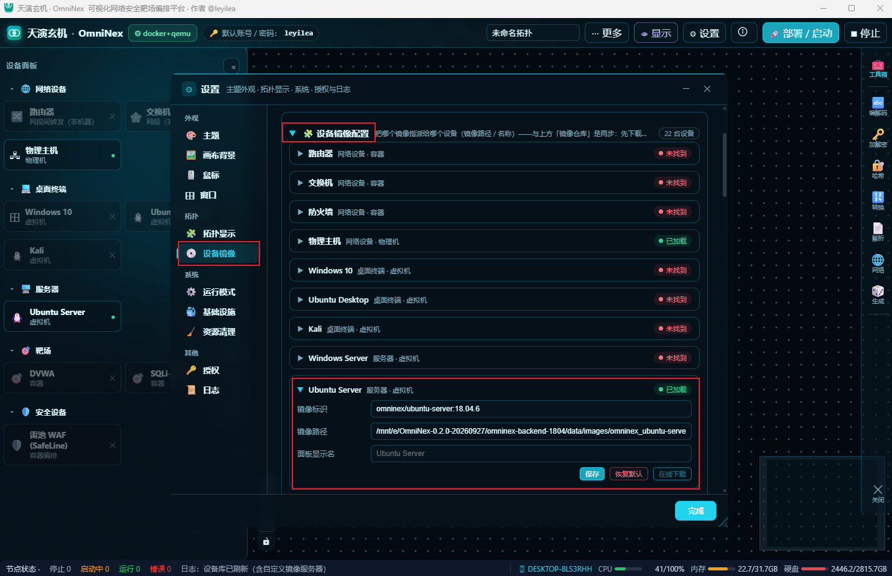

1.  **在“设备面板”显示为绿色，则可正常使用**

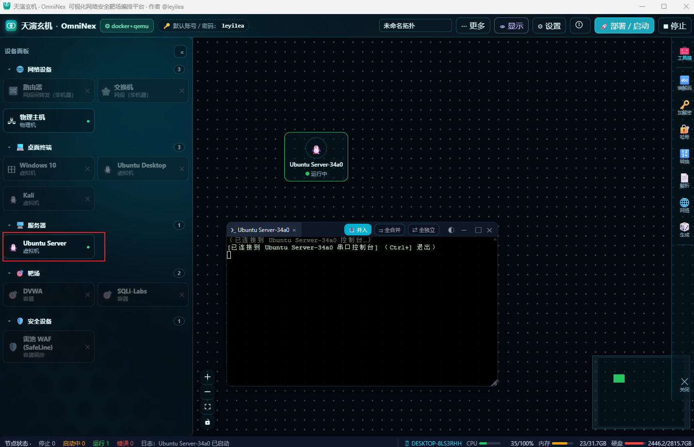

#### Windows+远程Ubuntu模式

1.  **推荐把镜像放入解压omninex-backend-linux.tar.gz的/data/imgaes目录下**

2.  -   比如这里的`/root/omninex-backend-1804/data/images/`

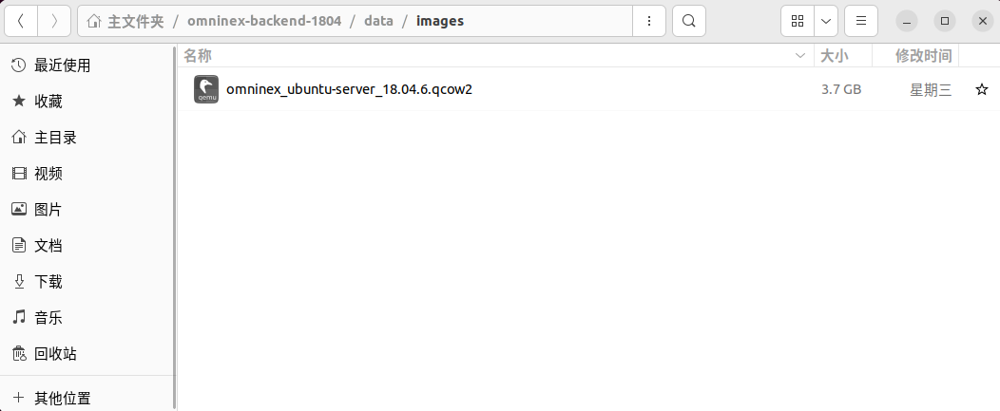

1.  **在OmniNex平台中设置对应路径**

2.  -   镜像路径填入/root/omninex-backend-1804/data/images/omninex_ubuntu-server_18.04.6.qcow2，并保存，提示“已加载”

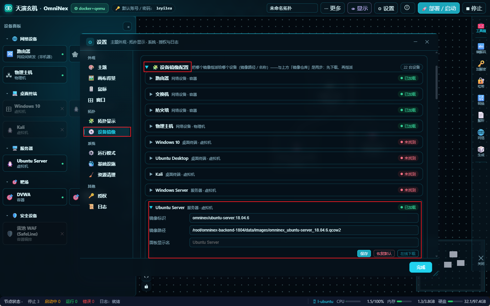

1.  **在设备面板可以正常使用**

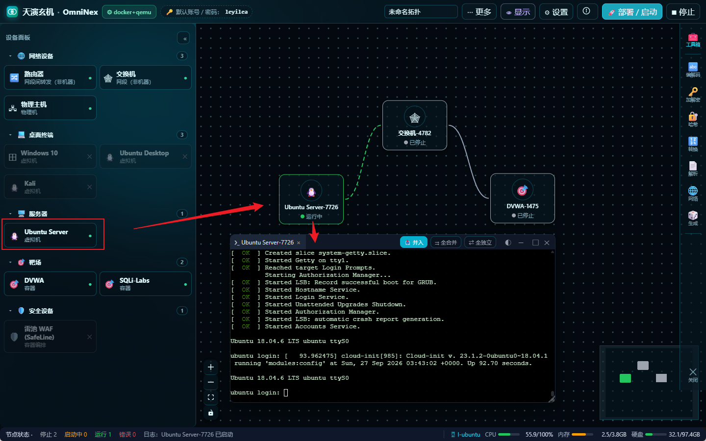